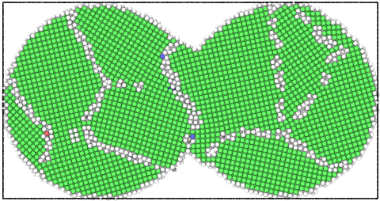
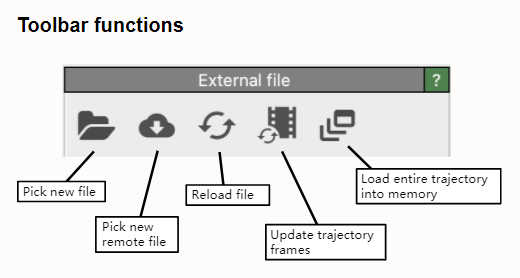
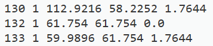
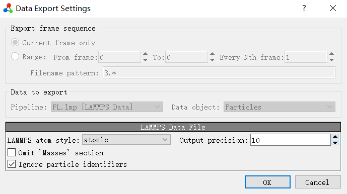
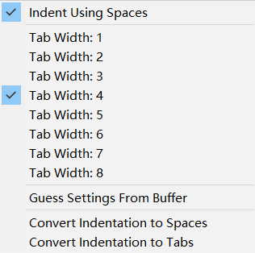

[TOC]
## Lammps

### 能量最小化

最小化前（原子重叠）


最小化后（原子不再重叠）



总结：能量最小化用来得到体系能量最小稳定的初始构型。
### 弛豫

弛豫同样能得到体系能量最小稳定的初始构型。
举个例子：众所周知，Ni的晶格常数为3.5288，那么我们可以在建模时改变晶格常数为1.5288和5.5288。然后在lammps里面弛豫，观察弛豫之后的结果。事实证明，两种情况下，最终都能得到正确的晶格尺寸。然而5.5288得到的结果是有问题的，晶体结构被破坏了。

```
atomsk --create fcc 3.5288 Ni -duplicate 10 10 10 1.lmp
```


```
#---------------------初始化---------------------
units metal
boundary p p p  
atom_style atomic
timestep 0.001 
read_data 1.lmp
thermo 10
dump myDump all atom 10 dump2.atom
#---------------------定义势函数、邻居列表---------------------
#pair_style eam/fs
#pair_coeff * * Ni1_Mendelev_2012.eam.fs Ni                    

pair_style meam/c  
pair_coeff * * library.Ni.meam Ni Ni.meam Ni     

neighbor 2.0 bin
neigh_modify every 1 delay 0 check yes
print "读入势函数"
velocity all create 300 12345 dist gaussian
#---------------------定义系统初始状态、能量最小化---------------------
minimize 1.0e-12 1.0e-12 10000 10000
write_data  min.lmp

fix 34 all npt temp 300 300 $(100*dt) iso 0.0 0.0 $(1000*dt) drag 1.0
run 5000
write_data  chiyu.lmp
```

### 温度与动能的转换

在`metal`单位下，动能`E`的单位为`ev` 与`J`的转换关系为：1ev = 1.6021766e-19J，令为n

K<sub>B</sub>为玻尔兹曼常数，K<sub>B</sub> = 1.3806504e-23

$$
T = \frac{E \times n}{1.5 \times N \times K_B}
，E = \frac{1.5 \times N \times K_B \times T}{n} 
$$

### 使用手册

手册可以分为三个部分：分别是用户指南、程序员指南、索引。

对于初学者而言，建议多多浏览用户指南部分，这部分从0开始详细介绍了Lammps软件。包括软件概述、如何安装（安装lammps建议阅读8.6.4）、如何运行。特别是在第5部分Commands中，开篇便详细介绍了何为Lammps输入脚本，输入脚本的语法规则。此外，对输入脚本的结构，即脚本通常可以分为哪几个部分（初始化、建模、势函数、运行），每一部分大致包含哪些指令都做了详细的介绍。

用户指南的第8章是Howto discussions，这部分建议不论是初学者还是Lammps老手都应该认真学习。其中包含了对系综、控温方法等的详细解释，以及一些使用技巧的介绍。

值得注意的是，我们经常查阅的命令语法部分放在了程序员指南中的Commands中，遇到不会的命令，直接搜索阅读就可以了。

### commands

```
set		group lower type 2
set		group upper type 3
```

### group函数与输出

```
variable a equal count(Gcount1)
print Gcount1中的原子数目为：$a
```

## Atomsk

利用atomsk可以得到石墨烯、碳纳米管、常见金属的初始模型，并切割得到几何构型如球、圆柱等。需要将模型进行组合时建议使用ovito。虽然atomsk内也能进行，但过于繁琐，易出错。

[working with LAMMPS files](https://atomsk.univ-lille.fr/tutorial_lammps.php)

### 构建多晶

使用atomsk可以很方便的构建多晶

```
atomsk --polycrystal Ni.lmp polycrystal.txt -wrap -duplicate 1 1 10 -select out cylinder Z 0.5*box 0.5*box 50 -rmatom select FL.lmp
```

Ni.lmp为一个晶胞，也称为种子。polycrystal.txt的内容如下：

```
box 130 130 1
random 12
```

但是构建的多晶在晶界处原子的排列有问题，杂乱无章且原子之间的间距过小，不稳定。

## Ovito

### 重新加载文件



重新加载文件：从外部文件重新加载当前动画帧的数据。如果文件内容已更新或替换，例如在外部程序中重新运行模拟或编辑文件后，此功能非常有用。

### python接口

首先安装ovito库，在cmd中运行以下命令

```
pip install ovito
```

接着便可以通过python脚本操作ovito了，例如下面的例子用来删除Ni原子

```python
from ovito.io import import_file, export_file
from ovito.modifiers import SelectTypeModifier, DeleteSelectedModifier

pipeline = import_file('input_file.lmp')
pipeline.modifiers.append(SelectTypeModifier(property='Particle Type', types={'Ni'}))
pipeline.modifiers.append(DeleteSelectedModifier())
export_file(pipeline, 'out_file.lmp', 'lammps/data', atom_style="atomic")
```

官方的帮助文档：https://www.ovito.org/docs/current/python/

### 删除原子

原子被删除后，导出的data文件原子序号并没有重新排布，只是少了几个。例如将131号原子删除后：



要想解决这个问题，只需要在导出data文件时，勾选上忽略原子标号：



## Sublime

### 快速选中到最后一行

系统默认的快捷键是：ctrl+shift+end，由于我的笔记本电脑没有end键，故需要自定义快捷键。

Preferences > Key Bindings — User 

在User中加入下面这行，

```
{ "keys": ["shift+tab"], "command": "move_to", "args": {"to": "eof", "extend": true} }
```

常用快捷键代码如下：

```
{ "keys": ["left"], "command": "move", "args": {"by": "characters", "forward": false} },
{ "keys": ["right"], "command": "move", "args": {"by": "characters", "forward": true} },
{ "keys": ["up"], "command": "move", "args": {"by": "lines", "forward": false} },
{ "keys": ["down"], "command": "move", "args": {"by": "lines", "forward": true} },
{ "keys": ["shift+left"], "command": "move", "args": {"by": "characters", "forward": false, "extend": true} },
{ "keys": ["ctrl+end"], "command": "move_to", "args": {"to": "eof", "extend": false} },
{ "keys": ["ctrl+shift+end"], "command": "move_to", "args": {"to": "eof", "extend": true} },
```

### 常用快捷键

Ctrl+Shift+P：打开命令面板 
Ctrl+P：搜索项目中的文件 
Ctrl+G：跳转到第几行 
Ctrl+W：关闭当前打开文件 
Ctrl+Shift+W：关闭所有打开文件 
Ctrl+Shift+V：粘贴并格式化 
Ctrl+D：选择单词，重复可增加选择下一个相同的单词 
Ctrl+L：选择行，重复可依次增加选择下一行 
Ctrl+Shift+L：选择多行 
Ctrl+Shift+Enter：在当前行前插入新行 
Ctrl+X：删除当前行 
Ctrl+M：跳转到对应括号 
Ctrl+U：软撤销，撤销光标位置 
Ctrl+J：选择标签内容 
Ctrl+F：查找内容 
Ctrl+Shift+F：查找并替换 
Ctrl+H：替换 
Ctrl+R：前往 method 
Ctrl+N：新建窗口 
Ctrl+K+B：开关侧栏 
Ctrl+Shift+M：选中当前括号内容，重复可选着括号本身 
Ctrl+F2：设置/删除标记 
Ctrl+/：注释当前行 
Ctrl+Shift+/：当前位置插入注释 
Ctrl+Alt+/：块注释，并Focus到首行，写注释说明用的 
Ctrl+Shift+A：选择当前标签前后，修改标签用的 
F11：全屏 
Shift+F11：全屏免打扰模式，只编辑当前文件 
Alt+F3：选择所有相同的词 
Alt+.：闭合标签 
Alt+Shift+数字：分屏显示 
Alt+数字：切换打开第N个文件 
Shift+右键拖动：光标多不，用来更改或插入列内容 
鼠标的前进后退键可切换Tab文件 
按Ctrl，依次点击或选取，可需要编辑的多个位置 
按Ctrl+Shift+上下键，可替换行

选择类

Ctrl+D 选中光标所占的文本，继续操作则会选中下一个相同的文本。

Alt+F3 选中文本按下快捷键，即可一次性选择全部的相同文本进行同时编辑。举个栗子：快速选中并更改所有相同的变量名、函数名等。

Ctrl+L 选中整行，继续操作则继续选择下一行，效果和 Shift+↓ 效果一样。

Ctrl+Shift+L 先选中多行，再按下快捷键，会在每行行尾插入光标，即可同时编辑这些行。

Ctrl+Shift+M 选择括号内的内容（继续选择父括号）。举个栗子：快速选中删除函数中的代码，重写函数体代码或重写括号内里的内容。

Ctrl+M 光标移动至括号内结束或开始的位置。

Ctrl+Enter 在下一行插入新行。举个栗子：即使光标不在行尾，也能快速向下插入一行。

Ctrl+Shift+Enter 在上一行插入新行。举个栗子：即使光标不在行首，也能快速向上插入一行。

Ctrl+Shift+[ 选中代码，按下快捷键，折叠代码。

Ctrl+Shift+] 选中代码，按下快捷键，展开代码。

Ctrl+K+0 展开所有折叠代码。

Ctrl+← 向左单位性地移动光标，快速移动光标。

Ctrl+→ 向右单位性地移动光标，快速移动光标。

shift+↑ 向上选中多行。

shift+↓ 向下选中多行。

Shift+← 向左选中文本。

Shift+→ 向右选中文本。

Ctrl+Shift+← 向左单位性地选中文本。

Ctrl+Shift+→ 向右单位性地选中文本。

Ctrl+Shift+↑ 将光标所在行和上一行代码互换（将光标所在行插入到上一行之前）。

Ctrl+Shift+↓ 将光标所在行和下一行代码互换（将光标所在行插入到下一行之后）。

Ctrl+Alt+↑ 向上添加多行光标，可同时编辑多行。

Ctrl+Alt+↓ 向下添加多行光标，可同时编辑多行。

编辑类

Ctrl+J 合并选中的多行代码为一行。举个栗子：将多行格式的CSS属性合并为一行。

Ctrl+Shift+D 复制光标所在整行，插入到下一行。

Tab 向右缩进。

Shift+Tab 向左缩进。

Ctrl+K+K 从光标处开始删除代码至行尾。

Ctrl+Shift+K 删除整行。

Ctrl+/ 注释单行。

Ctrl+Shift+/ 注释多行。

Ctrl+K+U 转换大写。

Ctrl+K+L 转换小写。

Ctrl+Z 撤销。

Ctrl+Y 恢复撤销。

Ctrl+U 软撤销，感觉和 Gtrl+Z 一样。

Ctrl+F2 设置书签

Ctrl+T 左右字母互换。

F6 单词检测拼写

搜索类

Ctrl+F 打开底部搜索框，查找关键字。

Ctrl+shift+F 在文件夹内查找，与普通编辑器不同的地方是sublime允许添加多个文件夹进行查找，略高端，未研究。

Ctrl+P 
打开搜索框。举个栗子：1、输入当前项目中的文件名，快速搜索文件，2、输入@和关键字，查找文件中函数名，3、输入：和数字，跳转到文件中该行代码，4、输入#和关键字，查找变量名。

Ctrl+G 打开搜索框，自动带：，输入数字跳转到该行代码。举个栗子：在页面代码比较长的文件中快速定位。

Ctrl+R 打开搜索框，自动带@，输入关键字，查找文件中的函数名。举个栗子：在函数较多的页面快速查找某个函数。

Ctrl+： 打开搜索框，自动带#，输入关键字，查找文件中的变量名、属性名等。

Ctrl+Shift+P 打开命令框。场景栗子：打开命名框，输入关键字，调用sublime 
text或插件的功能，例如使用package安装插件。

Esc 退出光标多行选择，退出搜索框，命令框等。

显示类

Ctrl+Tab 按文件浏览过的顺序，切换当前窗口的标签页。

Ctrl+PageDown 向左切换当前窗口的标签页。

Ctrl+PageUp 向右切换当前窗口的标签页。

Alt+Shift+1 窗口分屏，恢复默认1屏（非小键盘的数字）

Alt+Shift+2 左右分屏-2列

Alt+Shift+3 左右分屏-3列

Alt+Shift+4 左右分屏-4列

Alt+Shift+5 等分4屏

Alt+Shift+8 垂直分屏-2屏

Alt+Shift+9 垂直分屏-3屏

Ctrl+K+B 开启/关闭侧边栏。

F11 全屏模式

Shift+F11 免打扰模式

### 自定义in文件高亮

需要安装包管理器

 [in.sublime-syntax](Every-day-notes.assets\in.sublime-syntax) 

 [lmp.sublime-syntax](Every-day-notes.assets\lmp.sublime-syntax) 

 [lammps.sublime-syntax](Every-day-notes.assets\lammps.sublime-syntax) 

### 缩进

缩进可以使用空格和tab，tab具有自动对齐的功能，推荐使用tab键编写in文件。



注意，在python中不支持tab键和空格建的混用，所以最好用4个空格代替tab键。

## Python

### 用python脚本实现in文件的循环执行

```python
#对多个模型进行旋转
import os
import random
OutFile = "test.in"
for x in range(1,33):
    a = random.randint(0, 360)
    print(a)
    open(OutFile, "w", encoding = 'utf-8').write(f'''
    #---------------------初始化---------------------
    units metal
    boundary p p p  
    atom_style atomic
    timestep 0.001 
    read_data 80.lmp
    #---------------------修改模型---------------------
    displace_atoms all rotate $(lx/2) $(ly/2) 0 0 0 1 {a}
    write_data  {x}.lmp
    ''')
    os.system(f"lmp_serial -in test.in")
```

执行完毕后会生成32个data文件，分别是1.lmp到32.lmp

初始模型如下：


## Markdown

Markdown是一种[轻量级标记语言](https://baike.baidu.com/item/轻量级标记语言/52671915)，创始人为约翰·格鲁伯（英语：John Gruber）。 它允许人们使用易读易写的纯文本格式编写文档，然后转换成有效的XHTML（或者HTML）文档。这种语言吸收了很多在电子邮件中已有的纯文本标记的特性。

由于Markdown的轻量化、易读易写特性，并且对于图片，图表、数学式都有支持，目前许多网站都广泛使用Markdown来撰写帮助文档或是用于论坛上发表消息。 如[GitHub](https://baike.baidu.com/item/GitHub/10145341)、[Reddit](https://baike.baidu.com/item/Reddit/1272010)、[Diaspora](https://baike.baidu.com/item/Diaspora/10726893)、[Stack Exchange](https://baike.baidu.com/item/Stack Exchange/13777796)、[OpenStreetMap](https://baike.baidu.com/item/OpenStreetMap/3171606) 、[SourceForge](https://baike.baidu.com/item/SourceForge/6562141)、[简书](https://baike.baidu.com/item/简书/5782216)等，甚至还能被使用来撰写[电子书](https://baike.baidu.com/item/电子书/346054)。
**Markdown可以快速转化为演讲PPT、Word产品文档甚至是用非常少量的代码完成最小可用原型。**
markdown热搜如下：

- markdown **表格**
- markdown **公式**
- markdown **流程图**
- markdown **图片**
- markdown **换行**
- markdown **高亮**
- markdown **加粗**
- markdown **缩进**
- markdown **思维导图**
- markdown **代码块**

### markdown公式

关系运算符

| 运算符 | markdown |
| :----: | :------: |
|   ±    |   \pm    |
|   ×    |  \times  |
|   ÷    |   \div   |
|   ∑    |   \sum   |
|   ∏    |  \prod   |
|   ≠    |   \neq   |
|   ≤    |   \leq   |
|   ≥    |   \geq   |

分数，平方

|      算式      |      markdown      |
| :------------: | :----------------: |
| (7x+5)/(1+y^2) | \frac{7x+5}{1+y^2} |

## Windows

### 常用软件加入右键菜单

实现方式很简单，往注册表里加入几项即可。根据需要将下面的文字复制到文本文件中，格式改为.reg，双击运行。

```
Windows Registry Editor Version 5.00

[HKEY_CLASSES_ROOT\*\shell\open with ovito]
"Icon"="C:\\Program Files\\OVITO Basic\\ovito.exe,0"

[HKEY_CLASSES_ROOT\*\shell\open with ovito\command]
@="C:\\Program Files\\OVITO Basic\\ovito.exe %1"
```

```
Windows Registry Editor Version 5.00

[HKEY_CLASSES_ROOT\Directory\Background\shell\Terminal]
"Icon"="C:\\Program Files\\WindowsApps\\Microsoft.WindowsTerminal_1.4.3243.0_x64__8wekyb3d8bbwe\\wt.exe,0"

[HKEY_CLASSES_ROOT\Directory\Background\shell\Terminal\command]
@="wt.exe"
```

```
Windows Registry Editor Version 5.00

[HKEY_CLASSES_ROOT\Directory\Background\shell\Typora]
"Icon"="C:\\Program Files\\Typora\\Typora.exe"

[HKEY_CLASSES_ROOT\Directory\Background\shell\Typora\command]
@="C:\\Program Files\\Typora\\Typora.exe"

```

## Ubuntu

### 常用指令收集

$是普通管理员，#是系统管理员
切换用户：su uszp
切换管理员：su root
net start sshd
screen -S
screen -ls
sudo apt install net-tools
ipconfig #windows powershell
ifconfig #ubuntu
hpc@222.199.222.242
lirui@222.199.222.166
HuaweiSzp@222.199.222.221
scp -r lirui@222.199.222.166:/home/lirui/桌面/孙展鹏/test.in .