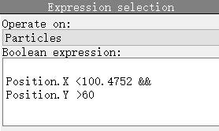

[TOC]
## Lammps

### Linux版本安装

- 微软应用商店安装window terminal

- 在`windows功能`中启用虚拟机相关功能，重启电脑

- 安装[适用于 x64 计算机的 WSL2 Linux 内核更新包](https://wslstorestorage.blob.core.windows.net/wslblob/wsl_update_x64.msi)

- wsl --set-default-version 2

- 微软应用商店安装ubutu，第一次打开时会自动安装，提示输入用户名和密码（直接关闭即可成为root用户，不建议）

- ```shell
  #查看分配给ubuntu的wsl版本, *是默认打开的发行版
  wsl -l -v
  ```

- Ubuntu换源：https://mirrors.tuna.tsinghua.edu.cn/help/ubuntu/ Ubuntu的软件源配置文件是 `/etc/apt/sources.list`

- ```bash
  #依次执行以下命令，学校网络不稳定，有时下载过慢，可用手机热点
  $ sudo add-apt-repository ppa:gladky-anton/lammps
  $ sudo add-apt-repository ppa:openkim/latest
  $ sudo apt-get update
  $ sudo apt-get install lammps-stable
  ```

- lammps安装路径：\\wsl$\Ubuntu\usr\share\doc\lammps-stable-doc\examples

- `````
  #打开terminal的设置文件，找到defaults添加一行命令，如下所示：
  "defaults":
  {
  	"startingDirectory" : ".", //使用注册表在当前文件夹打开
  	// Put settings here that you want to apply to all profiles.
  },
  `````

- ```
  #将termianal加入右键菜单
  #以下内容复制到文本文件中，改为.reg文件，双击运行
  Windows Registry Editor Version 5.00
  
  [HKEY_CLASSES_ROOT\Directory\Background\shell\Terminal]
  "Icon"="C:\\Program Files\\WindowsApps\\Microsoft.WindowsTerminal_1.4.3243.0_x64__8wekyb3d8bbwe\\wt.exe,0"
  
  [HKEY_CLASSES_ROOT\Directory\Background\shell\Terminal\command]
  @="wt %1"
  ```

- ```
  #安装oh-my-zsh,可选
  sudo apt install zsh
  chsh -s $(which zsh)
  sh -c "$(wget -O- https://raw.githubusercontent.com/ohmyzsh/ohmyzsh/master/tools/install.sh)"
  ```
  
- ```
  #安装插件zsh-syntax-highlighting，可选，依赖oh-my-zsh
  #插件来源：https://github.com/zsh-users
  1.git clone https://github.com/zsh-users/zsh-syntax-highlighting.git ${ZSH_CUSTOM:-~/.oh-my-zsh/custom}/plugins/zsh-syntax-highlighting
  2.Activate the plugin in ~/.zshrc : plugins=( [plugins...] zsh-syntax-highlighting)
  3.Start a new terminal session.
  ```

- ```
  #安装插件zsh-autosuggestions，可选，依赖oh-my-zsh
  1.git clone https://github.com/zsh-users/zsh-autosuggestions ${ZSH_CUSTOM:-~/.oh-my-zsh/custom}/plugins/zsh-autosuggestions
  2.Activate the plugin in ~/.zshrc : plugins=([plugins...] zsh-autosuggestions)
  3.Start a new terminal session.
  ```

### 能量最小化

最小化前（原子重叠）


最小化后（原子不再重叠）


总结：能量最小化用来得到体系能量最小稳定的初始构型。
### 弛豫

弛豫同样能得到体系能量最小稳定的初始构型。
举个例子：众所周知，Ni的晶格常数为3.5288，那么我们可以在建模时改变晶格常数为1.5288和5.5288。然后在lammps里面弛豫，观察弛豫之后的结果。事实证明，两种情况下，最终都能得到正确的晶格尺寸。然而5.5288得到的结果是有问题的，晶体结构被破坏了。

```shell
atomsk --create fcc 3.5288 Ni -duplicate 10 10 10 1.lmp
```


```
#---------------------初始化---------------------
units metal
boundary p p p  
atom_style atomic
timestep 0.001 
read_data 1.lmp
thermo 10
dump myDump all atom 10 dump2.atom
#---------------------定义势函数、邻居列表---------------------
#pair_style eam/fs
#pair_coeff * * Ni1_Mendelev_2012.eam.fs Ni                    

pair_style meam/c  
pair_coeff * * library.Ni.meam Ni Ni.meam Ni     

neighbor 2.0 bin
neigh_modify every 1 delay 0 check yes
print "读入势函数"
velocity all create 300 12345 dist gaussian
#---------------------定义系统初始状态、能量最小化---------------------
minimize 1.0e-12 1.0e-12 10000 10000
write_data  min.lmp

fix 34 all npt temp 300 300 $(100*dt) iso 0.0 0.0 $(1000*dt) drag 1.0
run 5000
write_data  chiyu.lmp
```

### 温度与动能的转换

在`metal`单位下，动能`E`的单位为`ev` 与`J`的转换关系为：1ev = 1.6021766e-19J，令为n。

K<sub>B</sub>为玻尔兹曼常数，K<sub>B</sub> = 1.3806504e-23

$$
T = \frac{E \times n}{1.5 \times N \times K_B}，E = \frac{1.5 \times N \times K_B \times T}{n}
$$

### 使用手册

手册可以分为三个部分：分别是用户指南、程序员指南、索引。

对于初学者而言，建议多多浏览用户指南部分，这部分从0开始详细介绍了Lammps软件。包括软件概述、如何安装（安装lammps建议阅读8.6.4）、如何运行。特别是在第5部分Commands中，开篇便详细介绍了何为Lammps输入脚本，输入脚本的语法规则。此外，对输入脚本的结构，即脚本通常可以分为哪几个部分（初始化、建模、势函数、运行），每一部分大致包含哪些指令都做了详细的介绍。

用户指南的第8章是Howto discussions，这部分建议不论是初学者还是Lammps老手都应该认真学习。其中包含了对系综、控温方法等的详细解释，以及一些使用技巧的介绍。

值得注意的是，我们经常查阅的命令语法部分放在了程序员指南中的Commands中，遇到不会的命令，直接搜索阅读就可以了。

### commands

```
set		group lower type 2
set		group upper type 3
```

### group函数与输出

```
variable a equal count(Gcount1) #Gcount1为动态时输出结果为0
print Gcount1中的原子数目为：$a
```

### 固定基底

将受力和速度设为0即可

```
fix			0 Gboundary setforce 0.0 0.0 0.0
velocity 	Gboundary set 0.0 0.0 0.0
```

### 动态group与静态group

```
group mine dynamic all region myRegion every 100
```

> 默认情况下组是静态的，这意味着原子被永久地分配给组。例如，如果使用region样式将原子分配给一个组，那么即使这些原子后来移出该区域，它们也将保留在组中。如下所述，动态样式可用于使组动态，以便周期性地确定组中有哪些原子。由于许多lammps命令对原子组进行操作，因此您应该仔细考虑对模型进行组动态是否有意义。

> 动态样式将现有组或新组标记为动态组。这意味着在模拟运行时，原子将被周期性地(重新)分配到组中。这与静态基团形成了鲜明对比，在静态基团中，原子被永久地分配到这个基团上。赋值的方式如下。在应用以下条件之前，只有通过parent-id指定为父组的组中的原子才会被分配给动态组。如果使用region关键字，则将从动态组中删除不在指定区域中的原子。

郎之万控温命令能作用于动态group，fix heat 则不能。

### errors

运行lammps遇到错误时，我们的第一反应往往是在网络上搜索。然而，手册中其实按字母顺序列出了所有的错误信息并给出了错误原因，因此直接在手册中搜索更为直接。

> This is an alphabetic list of the ERROR messages LAMMPS prints out and the reason why. If the explanation hereis not sufficient, the documentation for the offending command may help. Error messages also list the source file andline number where the error was generated. For example, a message like this:
>
> ```
> ERROR: Illegal velocity command (velocity.cpp:78)
> ```
>
> means that line #78 in the file src/velocity.cpp generated the error. Looking in the source code may help you figure outwhat went wrong.
> `Note that error messages from user-contributed packages are not listed here`. If such an error occurs and is not selfexplanatory,you will need to look in the source code or contact the author of the package.

### 剩余计算时间

```
thermo_style custom step temp etotal c_myTemp[*] v_abc cpu cpuremain
```

> cpu = elapsed CPU time in seconds since start of this run
>
> cpuremain = estimated CPU time remaining in run

### meam/c

```
pair_style meam/c
pair_coeff * * library.meam Ni Cr Fe NiCrFe.meam Ni Cr Fe
```

>只有一个pair_coeff命令与meam样式一起使用，它指定了两个meam文件和要提取信息的元素。通过在pair_coeff命令的第二个文件名后指定N个附加参数，将MEAM元素映射到LAMMPS atom类型，其中N是LAMMPS原子类型的数量。
>
>- MEAM library file
>- Elem1, Elem2, . . .
>- MEAM parameter file
>- N element names = mapping of MEAM elements to atom types
>

> Note: If the second filename is NULL, the element names between the two filenames can appear in any order, e.g.“Si C” or “C Si” in the example above. However, if the second filename is not NULL (as in the example above), it contains settings that are Fortran-indexed for the elements that precede it. Thus you need to insure you list the elements between the filenames in an order consistent with how the values in the second filename are indexed. See details below on the syntax for settings in the second file.

`总结：两个文件名之间的元素，顺序应按文件中的元素顺序来。两个文件名之后的元素，顺序按照你的data文件来。`

### 重新开始计算

lammps在每次运行时会先读入in文件中的所有内容，那么如果in文件的最后几部分需要修改该怎么办呢？

```
write_restart restart.equil
```

>编写当前模拟状态的二进制重启文件。
>
>在长时间的模拟过程中，通常使用restart命令周期性地输出重启文件。
>write_restart命令在进行最小化操作后或希望写入单个当前重启文件时非常有用。

### 变量

在lammps中，变量可以有很多种类型，比如equal，atom，loop，index等。对于equal变量，遵循`用时才更新，不用不更新`的原则。例如：应变strain可以这样计算：

```
variable tmp equal "lz"
variable L0 equal ${tmp}
variable strain equal "(lz - v_L0)/v_L0"
```

atom类型的变量例子如下：

```shell
variable m          equal   1/${radius} 
variable Vtest1     atom    2-($m*(sqrt((x-${rad_x})^2+(y-${rad_y})^2))) #变化范围是1~2
variable Vtest2     equal   ((step-${chiyu})/${SLM1_up})*5               #变化范围是0~5
variable Tr0        atom    300*(1+v_Vtest1*v_Vtest2)                    #变化范围是6~11
```

### 判断及循环

```
print 1234
variable a index 5 10 15 16 17 20
#variable a loop 20
label xyz
if "$a > 16" then "print $a" else "print a小于等于16"
next a
jump 1.in xyz
```

## Atomsk

利用atomsk可以得到石墨烯、碳纳米管、常见金属的初始模型，并切割得到几何构型如球、圆柱等。需要将模型进行组合时建议使用ovito。虽然atomsk内也能进行，但过于繁琐，易出错。

[working with LAMMPS files](https://atomsk.univ-lille.fr/tutorial_lammps.php)

### 构建多晶

使用atomsk可以很方便的构建多晶

```
atomsk --polycrystal Ni.lmp polycrystal.txt -wrap -duplicate 1 1 10 -select out cylinder Z 0.5*box 0.5*box 50 -rmatom select FL.lmp
```

Ni.lmp为一个晶胞，也称为种子。polycrystal.txt的内容如下：

```
box 130 130 1
random 12
```

但是构建的多晶在晶界处原子的排列有问题，杂乱无章且原子之间的间距过小，不稳定。

## Ovito

### 重新加载文件


重新加载文件：从外部文件重新加载当前动画帧的数据。如果文件内容已更新或替换，例如在外部程序中重新运行模拟或编辑文件后，此功能非常有用。

### python接口

首先安装ovito库，在cmd中运行以下命令

```shell
pip install ovito
```

接着便可以通过python脚本操作ovito了，例如下面的例子用来删除Ni原子

```python
from ovito.io import import_file, export_file
from ovito.modifiers import SelectTypeModifier, DeleteSelectedModifier

pipeline = import_file('input_file.lmp')
pipeline.modifiers.append(SelectTypeModifier(property='Particle Type', types={'Ni'}))
pipeline.modifiers.append(DeleteSelectedModifier())
export_file(pipeline, 'out_file.lmp', 'lammps/data', atom_style="atomic")
```

官方的帮助文档：https://www.ovito.org/docs/current/python/

### 删除原子

原子被删除后，导出的data文件原子序号并没有重新排布，只是少了几个。例如将131号原子删除后：


要想解决这个问题，只需要在导出data文件时，勾选上忽略原子标号：


### 根据表达式选择



## Sublime

### 快速选中到最后一行

系统默认的快捷键是：ctrl+shift+end，由于我的笔记本电脑没有end键，故需要自定义快捷键。

Preferences > Key Bindings — User 

在User中加入下面这行，

```
{ "keys": ["shift+tab"], "command": "move_to", "args": {"to": "eof", "extend": true} }
```

常用快捷键代码如下：

```
{ "keys": ["left"], "command": "move", "args": {"by": "characters", "forward": false} },
{ "keys": ["right"], "command": "move", "args": {"by": "characters", "forward": true} },
{ "keys": ["up"], "command": "move", "args": {"by": "lines", "forward": false} },
{ "keys": ["down"], "command": "move", "args": {"by": "lines", "forward": true} },
{ "keys": ["shift+left"], "command": "move", "args": {"by": "characters", "forward": false, "extend": true} },
{ "keys": ["ctrl+end"], "command": "move_to", "args": {"to": "eof", "extend": false} },
{ "keys": ["ctrl+shift+end"], "command": "move_to", "args": {"to": "eof", "extend": true} },
```

### 常用快捷键

Ctrl+Shift+P：打开命令面板 
Ctrl+P：搜索项目中的文件 
Ctrl+G：跳转到第几行 
Ctrl+W：关闭当前打开文件 
Ctrl+Shift+W：关闭所有打开文件 
Ctrl+Shift+V：粘贴并格式化 
Ctrl+D：选择单词，重复可增加选择下一个相同的单词 
Ctrl+L：选择行，重复可依次增加选择下一行 
Ctrl+Shift+L：选择多行 
Ctrl+Shift+Enter：在当前行前插入新行 
Ctrl+X：删除当前行 
Ctrl+M：跳转到对应括号 
Ctrl+U：软撤销，撤销光标位置 
Ctrl+J：选择标签内容 
Ctrl+F：查找内容 
Ctrl+Shift+F：查找并替换 
Ctrl+H：替换 
Ctrl+R：前往 method 
Ctrl+N：新建窗口 
Ctrl+K+B：开关侧栏 
Ctrl+Shift+M：选中当前括号内容，重复可选着括号本身 
Ctrl+F2：设置/删除标记 
Ctrl+/：注释当前行 
Ctrl+Shift+/：当前位置插入注释 
Ctrl+Alt+/：块注释，并Focus到首行，写注释说明用的 
Ctrl+Shift+A：选择当前标签前后，修改标签用的 
F11：全屏 
Shift+F11：全屏免打扰模式，只编辑当前文件 
Alt+F3：选择所有相同的词 
Alt+.：闭合标签 
Alt+Shift+数字：分屏显示 
Alt+数字：切换打开第N个文件 
Shift+右键拖动：光标多不，用来更改或插入列内容 
鼠标的前进后退键可切换Tab文件 
按Ctrl，依次点击或选取，可需要编辑的多个位置 
按Ctrl+Shift+上下键，可替换行

选择类

Ctrl+D 选中光标所占的文本，继续操作则会选中下一个相同的文本。

Alt+F3 选中文本按下快捷键，即可一次性选择全部的相同文本进行同时编辑。举个栗子：快速选中并更改所有相同的变量名、函数名等。

Ctrl+L 选中整行，继续操作则继续选择下一行，效果和 Shift+↓ 效果一样。

Ctrl+Shift+L 先选中多行，再按下快捷键，会在每行行尾插入光标，即可同时编辑这些行。

Ctrl+Shift+M 选择括号内的内容（继续选择父括号）。举个栗子：快速选中删除函数中的代码，重写函数体代码或重写括号内里的内容。

Ctrl+M 光标移动至括号内结束或开始的位置。

Ctrl+Enter 在下一行插入新行。举个栗子：即使光标不在行尾，也能快速向下插入一行。

Ctrl+Shift+Enter 在上一行插入新行。举个栗子：即使光标不在行首，也能快速向上插入一行。

Ctrl+Shift+[ 选中代码，按下快捷键，折叠代码。

Ctrl+Shift+] 选中代码，按下快捷键，展开代码。

Ctrl+K+0 展开所有折叠代码。

Ctrl+← 向左单位性地移动光标，快速移动光标。

Ctrl+→ 向右单位性地移动光标，快速移动光标。

shift+↑ 向上选中多行。

shift+↓ 向下选中多行。

Shift+← 向左选中文本。

Shift+→ 向右选中文本。

Ctrl+Shift+← 向左单位性地选中文本。

Ctrl+Shift+→ 向右单位性地选中文本。

Ctrl+Shift+↑ 将光标所在行和上一行代码互换（将光标所在行插入到上一行之前）。

Ctrl+Shift+↓ 将光标所在行和下一行代码互换（将光标所在行插入到下一行之后）。

Ctrl+Alt+↑ 向上添加多行光标，可同时编辑多行。

Ctrl+Alt+↓ 向下添加多行光标，可同时编辑多行。

编辑类

Ctrl+J 合并选中的多行代码为一行。举个栗子：将多行格式的CSS属性合并为一行。

Ctrl+Shift+D 复制光标所在整行，插入到下一行。

Tab 向右缩进。

Shift+Tab 向左缩进。

Ctrl+K+K 从光标处开始删除代码至行尾。

Ctrl+Shift+K 删除整行。

Ctrl+/ 注释单行。

Ctrl+Shift+/ 注释多行。

Ctrl+K+U 转换大写。

Ctrl+K+L 转换小写。

Ctrl+Z 撤销。

Ctrl+Y 恢复撤销。

Ctrl+U 软撤销，感觉和 Gtrl+Z 一样。

Ctrl+F2 设置书签

Ctrl+T 左右字母互换。

F6 单词检测拼写

搜索类

Ctrl+F 打开底部搜索框，查找关键字。

Ctrl+shift+F 在文件夹内查找，与普通编辑器不同的地方是sublime允许添加多个文件夹进行查找，略高端，未研究。

Ctrl+P 
打开搜索框。举个栗子：1、输入当前项目中的文件名，快速搜索文件，2、输入@和关键字，查找文件中函数名，3、输入：和数字，跳转到文件中该行代码，4、输入#和关键字，查找变量名。

Ctrl+G 打开搜索框，自动带：，输入数字跳转到该行代码。举个栗子：在页面代码比较长的文件中快速定位。

Ctrl+R 打开搜索框，自动带@，输入关键字，查找文件中的函数名。举个栗子：在函数较多的页面快速查找某个函数。

Ctrl+： 打开搜索框，自动带#，输入关键字，查找文件中的变量名、属性名等。

Ctrl+Shift+P 打开命令框。场景栗子：打开命名框，输入关键字，调用sublime 
text或插件的功能，例如使用package安装插件。

Esc 退出光标多行选择，退出搜索框，命令框等。

显示类

Ctrl+Tab 按文件浏览过的顺序，切换当前窗口的标签页。

Ctrl+PageDown 向左切换当前窗口的标签页。

Ctrl+PageUp 向右切换当前窗口的标签页。

Alt+Shift+1 窗口分屏，恢复默认1屏（非小键盘的数字）

Alt+Shift+2 左右分屏-2列

Alt+Shift+3 左右分屏-3列

Alt+Shift+4 左右分屏-4列

Alt+Shift+5 等分4屏

Alt+Shift+8 垂直分屏-2屏

Alt+Shift+9 垂直分屏-3屏

Ctrl+K+B 开启/关闭侧边栏。

F11 全屏模式

Shift+F11 免打扰模式

### 自定义in文件高亮

需要安装包管理器

 [in.sublime-syntax](Every-day-notes.assets\in.sublime-syntax) 

 [lmp.sublime-syntax](Every-day-notes.assets\lmp.sublime-syntax) 

 [lammps.sublime-syntax](Every-day-notes.assets\lammps.sublime-syntax) 

### 缩进

缩进可以使用空格和tab，tab具有对齐的功能，推荐使用tab键编写in文件。


注意，在python中不支持tab键和空格建的混用，所以最好用4个空格代替tab键。

```
"tab_size": 4,    
"translate_tabs_to_spaces": true,
```

### 常用设置

```shell
{
	"auto_indent": true,
	"color_scheme": "Packages/Color Scheme - Default/Breakers.sublime-color-scheme",
	"font_size": 13,
	"hot_exit":false,
	"ignored_packages":
	[
		"Vintage"
	],
	"indent_to_bracket": true,
	"tab_size": 4,
	"theme": "Adaptive.sublime-theme",
	"translate_tabs_to_spaces": true,
	"close_windows_when_empty":true,
	"remember_open_files":false,
}
```

## Python

### in文件的循环执行

```python
#对多个模型进行旋转
import os
import random
OutFile = "test.in"
for x in range(1,33):
    a = random.randint(0, 360)
    print(a)
    open(OutFile, "w", encoding = 'utf-8').write(f'''
    #---------------------初始化---------------------
    units metal
    boundary p p p  
    atom_style atomic
    timestep 0.001 
    read_data 80.lmp
    #---------------------修改模型---------------------
    displace_atoms all rotate $(lx/2) $(ly/2) 0 0 0 1 {a}
    write_data  {x}.lmp
    ''')
    os.system(f"lmp_serial -in test.in")
```

执行完毕后会生成32个data文件，分别是1.lmp到32.lmp

初始模型如下：


### 生成不同大小的多晶圆柱模型

```python
import os
import random
OutFile = "polycrystal.txt"
for x in range(0,2):
    a = random.randint(100, 200)
    open(OutFile, "w").write(f"box {a} {a} 1\nrandom 12")
    os.system(f'''atomsk --polycrystal Ni.lmp polycrystal.txt -wrap \
        -duplicate 1 1 10 -select out cylinder Z 0.5*box 0.5*box {a/4} \
        -rmatom select {x}.lmp''')
    os.system(f"del {x}.dat")
    os.system(f"del {x}_grains-com.xsf")
    os.system(f"del {x}_nodes.xsf")
    os.system(f"del {x}_grains-com.lmp")
    os.system(f"del {x}_nodes.lmp")
    os.system(f"del {x}_param.txt")
```

### 多线程执行atomsk

```python
import os
import time
import subprocess

for x in range(42, 501):
    p = subprocess.Popen(f'''atomsk --create fcc 3.624 Ni orient [-110] [112] [-1-11] \
    -duplicate 17 10 14 -select random 20% Ni -substitute Ni Cr \
    -select random 25% Ni -substitute Ni Fe -select random 33.33% Ni \
    -substitute Ni Co -select random 50% Ni -substitute Ni Al {x}.lmp''')
    time.sleep(3)
    p.kill()
```

```python
import os
import time
from multiprocessing import Pool

def makeLmp(x):
    os.system(f'''atomsk --create fcc 3.624 Ni orient [-110] [112] [-1-11] \
    -duplicate 17 10 14 -select random 20% Ni -substitute Ni Cr \
    -select random 25% Ni -substitute Ni Fe -select random 33.33% Ni \
    -substitute Ni Co -select random 50% Ni -substitute Ni Al {x}.lmp''')

def main():
    LoopList = list(range(1,21))
    print(LoopList)
    p = Pool() #p = Pool(processes=4)
    p.map(makeLmp, LoopList)
    p.close()
    p.join()

if __name__ == '__main__':
    main()
```


用os.system会出现atomsk卡住的现象。

## Markdown

Markdown是一种[轻量级标记语言](https://baike.baidu.com/item/轻量级标记语言/52671915)，创始人为约翰·格鲁伯（英语：John Gruber）。 它允许人们使用易读易写的纯文本格式编写文档，然后转换成有效的XHTML（或者HTML）文档。这种语言吸收了很多在电子邮件中已有的纯文本标记的特性。

由于Markdown的轻量化、易读易写特性，并且对于图片，图表、数学式都有支持，目前许多网站都广泛使用Markdown来撰写帮助文档或是用于论坛上发表消息。 如[GitHub](https://baike.baidu.com/item/GitHub/10145341)、[Reddit](https://baike.baidu.com/item/Reddit/1272010)、[Diaspora](https://baike.baidu.com/item/Diaspora/10726893)、[Stack Exchange](https://baike.baidu.com/item/Stack Exchange/13777796)、[OpenStreetMap](https://baike.baidu.com/item/OpenStreetMap/3171606) 、[SourceForge](https://baike.baidu.com/item/SourceForge/6562141)、[简书](https://baike.baidu.com/item/简书/5782216)等，甚至还能被使用来撰写[电子书](https://baike.baidu.com/item/电子书/346054)。
**Markdown可以快速转化为演讲PPT、Word产品文档甚至是用非常少量的代码完成最小可用原型。**
markdown热搜如下：

- markdown **表格**
- markdown **公式**
- markdown **流程图**
- markdown **图片**
- markdown **换行**
- markdown **高亮**
- markdown **加粗**
- markdown **缩进**
- markdown **思维导图**
- markdown **代码块**

### markdown公式

关系运算符

| 运算符 | markdown |
| :----: | :------: |
|   ±    |   \pm    |
|   ×    |  \times  |
|   ÷    |   \div   |
|   ∑    |   \sum   |
|   ∏    |  \prod   |
|   ≠    |   \neq   |
|   ≤    |   \leq   |
|   ≥    |   \geq   |

分数，平方

|      算式      |      markdown      |
| :------------: | :----------------: |
| (7x+5)/(1+y^2) | \frac{7x+5}{1+y^2} |

[隐藏链接用ctrl+k](https://github.com/ohmyzsh/ohmyzsh/wiki)

## Windows

### 常用软件加入右键菜单

实现方式很简单，往注册表里加入几项即可。根据需要将下面的文字复制到文本文件中，格式改为.reg，双击运行。

"startingDirectory" : ".", //使用注册表在当前文件夹打开

```shell
Windows Registry Editor Version 5.00

[HKEY_CLASSES_ROOT\*\shell\open with ovito]
"Icon"="C:\\Program Files\\OVITO Basic\\ovito.exe,0"

[HKEY_CLASSES_ROOT\*\shell\open with ovito\command]
@="C:\\Program Files\\OVITO Basic\\ovito.exe %1"
```

```shell
Windows Registry Editor Version 5.00

[HKEY_CLASSES_ROOT\Directory\Background\shell\Terminal]
"Icon"="C:\\Program Files\\WindowsApps\\Microsoft.WindowsTerminal_1.4.3243.0_x64__8wekyb3d8bbwe\\wt.exe,0"

[HKEY_CLASSES_ROOT\Directory\Background\shell\Terminal\command]
@="wt -p "Command Prompt" `; split-pane -p "Windows PowerShell" `; split-pane -H wsl.exe"
```

```shell
Windows Registry Editor Version 5.00

[HKEY_CLASSES_ROOT\Directory\Background\shell\Typora]
"Icon"="C:\\Program Files\\Typora\\Typora.exe"

[HKEY_CLASSES_ROOT\Directory\Background\shell\Typora\command]
@="C:\\Program Files\\Typora\\Typora.exe"

```

### wsl

https://docs.microsoft.com/en-us/windows/wsl/install-win10

https://docs.microsoft.com/zh-cn/windows/wsl/install-win10

PowerShell中输入wsl即可打开默认的Linux 分发版

改默认的Linux 分发版：`wsl -s Ubuntu-20.04`

可打开 PowerShell 命令行并输入以下命令（仅在 [Windows 内部版本 18362 或更高版本](ms-settings:windowsupdate)中可用），检查分配给每个已安装的 Linux 分发版的 WSL 版本：`wsl -l -v`

### windows terminal

```bash
// This file was initially generated by Windows Terminal 1.4.3243.0
// It should still be usable in newer versions, but newer versions might have additional
// settings, help text, or changes that you will not see unless you clear this file
// and let us generate a new one for you.

// To view the default settings, hold "alt" while clicking on the "Settings" button.
// For documentation on these settings, see: https://aka.ms/terminal-documentation
{
    "$schema": "https://aka.ms/terminal-profiles-schema",

    "defaultProfile": "{61c54bbd-c2c6-5271-96e7-009a87ff44bf}",

    // You can add more global application settings here.
    // To learn more about global settings, visit https://aka.ms/terminal-global-settings

    // If enabled, selections are automatically copied to your clipboard.
    "copyOnSelect": false,

    // If enabled, formatted data is also copied to your clipboard
    "copyFormatting": false,

    // A profile specifies a command to execute paired with information about how it should look and feel.
    // Each one of them will appear in the 'New Tab' dropdown,
    //   and can be invoked from the commandline with `wt.exe -p xxx`
    // To learn more about profiles, visit https://aka.ms/terminal-profile-settings
    "profiles":
    {
        "defaults":
        {
            "startingDirectory" : ".", //使用注册表在当前文件夹打开
            // Put settings here that you want to apply to all profiles.
        },
        "list":
        [
            {
                // Make changes here to the powershell.exe profile.
                "guid": "{61c54bbd-c2c6-5271-96e7-009a87ff44bf}",
                "name": "Windows PowerShell",
                "commandline": "powershell.exe",
                "hidden": false
            },
            {
                // Make changes here to the cmd.exe profile.
                "guid": "{0caa0dad-35be-5f56-a8ff-afceeeaa6101}",
                "name": "Command Prompt",
                "commandline": "cmd.exe",
                "hidden": false
            },
            {
                "guid": "{b453ae62-4e3d-5e58-b989-0a998ec441b8}",
                "hidden": false,
                "name": "Azure Cloud Shell",
                "source": "Windows.Terminal.Azure"
            },
            {
                "guid": "{2c4de342-38b7-51cf-b940-2309a097f518}",
                "hidden": false,
                "name": "Ubuntu",
                "source": "Windows.Terminal.Wsl"
            }
        ]
    },

    // Add custom color schemes to this array.
    // To learn more about color schemes, visit https://aka.ms/terminal-color-schemes
    "schemes": [],

    // Add custom actions and keybindings to this array.
    // To unbind a key combination from your defaults.json, set the command to "unbound".
    // To learn more about actions and keybindings, visit https://aka.ms/terminal-keybindings
    "actions":
    [
        // Copy and paste are bound to Ctrl+Shift+C and Ctrl+Shift+V in your defaults.json.
        // These two lines additionally bind them to Ctrl+C and Ctrl+V.
        // To learn more about selection, visit https://aka.ms/terminal-selection
        { "command": {"action": "copy", "singleLine": false }, "keys": "ctrl+c" },
        { "command": "paste", "keys": "ctrl+v" },

        // Press Ctrl+Shift+F to open the search box
        { "command": "find", "keys": "ctrl+shift+f" },

        // Press Alt+Shift+D to open a new pane.
        // - "split": "auto" makes this pane open in the direction that provides the most surface area.
        // - "splitMode": "duplicate" makes the new pane use the focused pane's profile.
        // To learn more about panes, visit https://aka.ms/terminal-panes
        { "command": { "action": "splitPane", "split": "auto", "splitMode": "duplicate" }, "keys": "alt+shift+d" }
    ]
}
```


## Ubuntu

### 安装

- Ubuntu官网下载ISO镜像文件，或者去国内的镜像网站下载也可以，比如[清华源](https://mirrors.tuna.tsinghua.edu.cn/#)
- 制作U盘启动盘，软件`Rufus`
- 正式开始安装，首先将U盘插到电脑上，开机时一直按[F2](对我的笔记本来说)，进入boot启动设置，将你的U盘置顶
- 可以先不安装，在U盘里尝试Ubuntu系统，有点像一个便携系统
- 开始安装，可以选择一个硬盘让其清空所有的内容，并自行安装，也可以手动分区

| 挂载点     | 容量 |                           说明                            |
| :--------- | :--: | :-------------------------------------------------------: |
| /          | 30G  |                          主分区                           |
| /boot      |  2G  | 逻辑分区，系统引导，类似于win中磁盘系统预留的100M左右空间 |
| /home      | 30G  |                  逻辑分区，存放用户文件                   |
| swap       | 4~6G |            逻辑分区，根据电脑内存大小选择容量             |
| /tmp       |      |                       系统临时缓存                        |
| /usr       |      |             系统软件，apt install即在这里安装             |
| /var       |      |              (variable)：与系统运作过程有关               |
| /srv       |      |                                                           |
| /opt       |      |                                                           |
| /usr/local |      |                                                           |

- 文件格式

### 常用指令收集

$是普通管理员，#是系统管理员
切换用户：su uszp
切换管理员：su root
net start sshd
screen -S
screen -ls
sudo apt install net-tools
ipconfig #windows powershell
ifconfig #ubuntu
hpc@222.199.222.242
lirui@222.199.222.166
HuaweiSzp@222.199.222.221
scp -r lirui@222.199.222.166:/home/lirui/桌面/孙展鹏/test.in .
ubuntu config --default-user 你的用户名

### 课题组服务器

桌面位置：\home\lirui\桌面

桌面个人文件夹位置：\mnt\data\孙展鹏\1-1-算例

转移数据位置：\media\lirui\lirui-data-old

## Git

### 安装git

https://git-scm.com/book/zh/v2/%E8%B5%B7%E6%AD%A5-%E5%AE%89%E8%A3%85-Git

### 初次运行 git 前的配置

```shell
$ git config --global user.name "John Doe"
$ git config --global user.email johndoe@example.com
```

.gitconfig中的内容

```
[user]
	name = Gszp
	email = 2961428921@qq.com
[core]
	editor = vim
	quotepath = false
[credential]
	helper = store
```

## SLM

### 模型

动态group

高熵合金 中熵合金 记忆合金 即有关材料的选择问题

连续扫描试试看，不同的功率下

### 分析

- 发现完整二十面体团簇在冷却速率较低的 Cu50Zr50 非晶粉末中含量较高。
- 熔池的热影响导致沉积层内类二十面体团簇的含量比熔覆层高，而经过激光熔化和热影响后 Frank-Kasper 多面体团簇的含量均基本不变。同时发现打印样品的极限拉伸强度、硬度和弹性模量与铸态样品测试数值相当。 
- 探究了工艺参数对激光选区熔化 Cu10Zr90 非晶合金微观结构与晶化行为的影响。发现当激光扫描速率较低时，BCC  晶相大量生成，并伴随少量  HCP
  和  FCC 晶相出现。提高激光扫描速率能明显降低样品中  BCC 相的含量，产生更多的类二十面体团簇，促进非晶态结构的形成。原因在于高的扫描速率大大降低了原子的弛豫时间，从而抑制了晶相的成核和长大。

### Ovito-Cluster analysis

该方法不行，调节截断距离时，团簇数量有较为明显的变化，但通过图像和`cluster size`可以看出，只是一些单个原子。

### Ovito-CNA

通过删除other原子的方法观察fcc、bcc、hcp原子数量的变化

